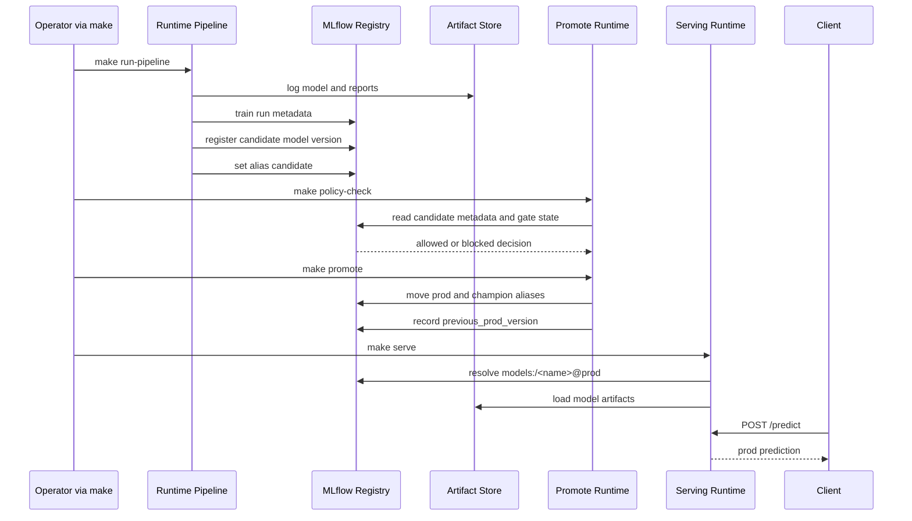

# M0 Portability Charter

Status: Accepted target shape for roadmap phase `M0`

Last updated: 2026-03-03

## Purpose

Freeze the target repository and package shape for
`M0: Stable portable local platform` before code moves.

Later `M0` PRs should cite this charter and the linked ADRs instead of arguing
about scope again.

This is a target-state document. For the current repo shape, see
[`current-state.md`](./current-state.md).

## Roadmap context

Repository roadmap phases:

- `M0`: Stable portable local platform
- `M1`: First hosted GCP staging platform
- `M2`: Operable GCP platform
- `M3`: Closed-loop MLOps
- `M4`: Scale-up and alternate backends

Near-term execution focus:

- `UP-01` through `UP-10`

## M0 goals

- freeze the package and repository shape before refactoring work begins
- keep the local Docker Compose developer and operator flow first-class
- narrow portability to a small, explicit backend seam
- preserve MLflow as the registry and release-control source of truth
- create a stable reference for later `M0` PRs

## M0 non-goals

- code movement in `UP-01`
- behavior changes in `UP-01`
- a new CLI in `UP-01`
- deployment work in `UP-01`

## M0 anti-goals

- replace MLflow with another registry or release-control system
- abstract every subsystem behind a portability interface
- make hosted GCP the primary developer path before `M1`
- redesign the serving API, release policy, or model lifecycle semantics
- introduce Kubernetes, Terraform, or environment-specific deployment work
- broaden the portability surface beyond `ArtifactStore`, `EventStore`,
  `JobRunner`, and `Secrets`
- collapse all existing operator workflows into a brand-new command surface

## Preserved invariants

- MLflow remains the registry and release-control source of truth.
- Local Docker Compose remains the first-class operator path.
- `make up`, `make run-pipeline`, `make policy-check`, `make promote`,
  `make serve`, `make smoke-test`, and `make e2e` remain valid local workflows.
- Alias-based release control remains `candidate`, `prod`, and `champion`.
- Promotion remains policy-gated and dry-run capable.
- Rollback remains alias mutation against MLflow metadata rather than rebuild or
  retrain.

## M0 portability boundary

`M0` portability is limited to the boundary between core logic and backend
implementations.

Portable interfaces:

- `ArtifactStore`
- `EventStore`
- `JobRunner`
- `Secrets`

Everything else stays concrete in `M0`, including:

- MLflow model registry and release control
- release policy evaluation
- lineage and reproducibility contracts
- serving routing behavior
- local Docker Compose operator flows

See [`ADR-0001-portability-surface.md`](../adrs/ADR-0001-portability-surface.md)
and
[`ADR-0002-mlflow-control-plane.md`](../adrs/ADR-0002-mlflow-control-plane.md).

## Target repository shape

This is the target `M0` tree. Later `M0` PRs may add or populate these paths.

```text
.
├── configs/
│   ├── local/
│   │   ├── pipeline.env
│   │   ├── promote.env
│   │   ├── rollback.env
│   │   └── serving.env
│   └── README.md
├── deployments/
│   ├── local/
│   │   ├── docker-compose.yml
│   │   └── README.md
│   └── README.md
├── docs/
│   ├── adrs/
│   │   ├── ADR-0001-portability-surface.md
│   │   └── ADR-0002-mlflow-control-plane.md
│   └── architecture/
│       ├── current-state.md
│       └── m0-portability-charter.md
├── src/ml_lifecycle_platform/
│   ├── backends/
│   │   ├── __init__.py
│   │   ├── interfaces/
│   │   │   ├── __init__.py
│   │   │   ├── artifact_store.py
│   │   │   ├── event_store.py
│   │   │   ├── job_runner.py
│   │   │   └── secrets.py
│   │   ├── local/
│   │   │   ├── __init__.py
│   │   │   ├── artifact_store.py
│   │   │   ├── event_store.py
│   │   │   ├── job_runner.py
│   │   │   └── secrets.py
│   │   └── mlflow/
│   │       ├── __init__.py
│   │       └── control_plane.py
│   ├── cli/
│   │   ├── __init__.py
│   │   ├── main.py
│   │   ├── pipeline.py
│   │   ├── registry.py
│   │   └── serving.py
│   ├── core/
│   │   ├── __init__.py
│   │   ├── config.py
│   │   ├── constants.py
│   │   ├── policy/
│   │   │   ├── __init__.py
│   │   │   └── release_policy.py
│   │   ├── registry/
│   │   │   ├── __init__.py
│   │   │   ├── promote.py
│   │   │   ├── register.py
│   │   │   ├── reproduce.py
│   │   │   └── rollback.py
│   │   └── contracts/
│   │       ├── __init__.py
│   │       ├── dataset_fingerprint.py
│   │       ├── feature_stats.py
│   │       ├── model_ref.py
│   │       └── repro_contract.py
│   └── runtime/
│       ├── __init__.py
│       ├── pipeline/
│       │   ├── __init__.py
│       │   ├── evaluate.py
│       │   ├── featurize.py
│       │   ├── ingest.py
│       │   ├── orchestrate.py
│       │   └── train.py
│       └── serving/
│           ├── __init__.py
│           ├── app.py
│           ├── constants.py
│           ├── metrics.py
│           ├── router.py
│           ├── settings.py
│           └── smoke_test.py
├── docker-compose.yml
├── Makefile
└── tests/
```

## Meaning of each target area

### `src/ml_lifecycle_platform/core/`

`core/` holds business logic that should stay stable when runtime wiring or
backend implementations change.

Contents:

- release policy rules
- registry workflows such as register, promote, rollback, and reproduce
- contracts for lineage, fingerprints, and reproducibility
- shared constants and config helpers that are not backend implementations

`core/` may depend on the narrow portability interfaces. It should not depend
on a broad set of backend-specific details.

### `src/ml_lifecycle_platform/backends/`

`backends/` holds backend-facing adapters and concrete implementations.

In `M0` it includes:

- the portable interface definitions for `ArtifactStore`, `EventStore`,
  `JobRunner`, and `Secrets` under `backends/interfaces/`
- local-first concrete implementations under `backends/local/`
- MLflow-specific control-plane integration code under `backends/mlflow/`

`backends/` is the only package area that should add portability adapters in
`M0`.

### `src/ml_lifecycle_platform/runtime/`

`runtime/` holds execution entrypoints and process wiring.

In `M0` it includes:

- pipeline step entrypoints
- orchestration wiring
- serving application wiring
- runtime-only settings and operational hooks

`runtime/` is where the system runs. It should not define release policy or
registry semantics.

### `src/ml_lifecycle_platform/cli/`

`cli/` is the future home for command entrypoints after the package split.

This charter reserves the package area and module names. `UP-01` does not add a
new CLI. Existing Makefile and module execution paths remain authoritative in
early `M0`.

### `configs/`

`configs/` is the future home for repo-root runtime configuration inputs.

In `M0` the reserved local shape is:

- `pipeline.env`
- `promote.env`
- `rollback.env`
- `serving.env`

### `deployments/`

`deployments/` is the future home for repo-root deployment assets.

In `M0` the reserved local path is:

- `deployments/local/docker-compose.yml`

This does not replace the current repo-root `docker-compose.yml`.

## Compatibility rule for local Compose

The current local Compose path stays valid in `M0`:

- the repo-root [`docker-compose.yml`](../../docker-compose.yml) remains valid
- the repo-root [`Makefile`](../../Makefile) remains the canonical local operator
  entrypoint
- later `M0` PRs may introduce `deployments/local/`, but they must not break the
  current `make`-driven local flow while `M0` is in progress

## Local sequence diagram

The local golden path for `train -> evaluate -> register -> promote -> serve`
stays:



## M0 review checklist

Reviewers for later `M0` PRs should check:

- every new package or file being introduced already appears in this charter
- portability work is limited to the four named interfaces
- MLflow remains the release-control source of truth
- the local Compose golden path is still present and documented
- scope changes are recorded by revising this charter or its ADRs first

## Rollback

This is a docs-only baseline.

If later `M0` work changes these boundaries, update this charter and the ADRs
before moving code.
